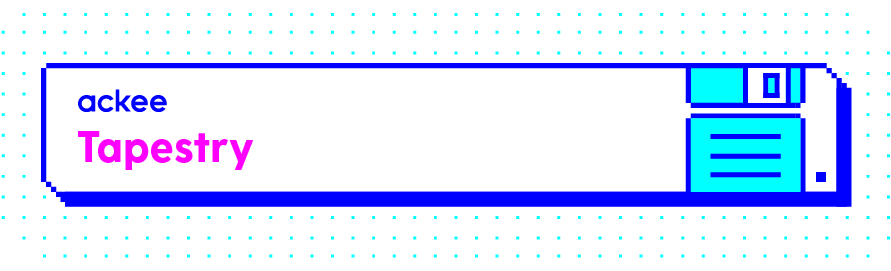

[](https://travis-ci.com/AckeeCZ/tapestry)

## What's Tapestry 🤔

Tapestry helps you with **creating** and **managing** your Swift frameworks 💫

Do you want to easily create a Swift framework that supports [Carthage][carthage], [Cocoapods][cocoapods] and [SPM][spm]?

Or define your release steps in a type-safe way?

Well, look no further, `tapestry` shall help you with exactly that!

## Projects Using Tapestry

| Project  | Repository                                                                             |
| -------- | -------------------------------------------------------------------------------------- |
| XcodeProj| [tuist/XcodeProj](https://github.com/tuist/xcodeproj)                               |
| ACKategories | [AckeeCZ/ACKategories](https://github.com/AckeeCZ/ACKategories) |

If you are also leveraging Tapestry in your project, feel free to open a PR to include it in the list above.

These repositories can also serve as a great example configuration for your own projects.

## Installation

### Using [mint](https://github.com/yonaskolb/mint)

```bash
$ mint install AckeeCZ/tapestry
```

### Using [SPM][spm]

Add this to your `Package.swift`:

```swift
.package(url: "https://github.com/AckeeCZ/tapestry.git", .branch("master")),
```

### Using Swift directly

```bash
$ git clone https://github.com/AckeeCZ/tapestry.git
$ cd tapestry
$ swift run tapestry
```

## Setup release steps

To get you started with tapestry (if you did not generate your framework with it!), you can run 
```bash
tapestry up
```

This will create a `TapestryConfig.swift` that you can then customize per your needs

To configure your release steps, run:
```bash
tapestry edit
```

This opens Xcode with easily editable `TapestryConfig.swift`.

The generated file will look like this:
```swift
import TapestryDescription

let config = TapestryConfig(release: Release(actions: [.pre(.docsUpdate),
                                                       .pre(.dependenciesCompatibility([.cocoapods, .carthage, .spm(.all)]))],
                                             add: ["README.md",
                                                   "YourLibraryName.podspec",
                                                   "CHANGELOG.md"],
                                             commitMessage: "Version \(Argument.version)",
                                             push: false))
```

Let's see how you can edit this by yourself to get the result you want.

# Release Github Action

Just by adding a simple tapestry step `.post(.githubRelease(owner: "owner", repository: "repository", assetPaths: ["build.zip"]))`
you can automate your whole release process with Github actions. If that sounds interesting to you, check out the [action here](https://github.com/fortmarek/tapestry-action)

To then create a new release with github action, simply run `tapestry github-release 0.0.1` and ... that's all! 🙂

# TapestryConfig.swift Manifest Documentation

## TapestryConfig

This currently only has one argument `release`, more will be added here

## Release

The main component of the release process.

| Property        | Description           | Type  | Optional      |   Default   |
| ------------- |:-------------:| :-----:| :-----:| :-----:|
| actions      | Your custom release steps, more about how you can define them below (see `ReleaseAction`) | [ReleaseAction] | No | []
| add      | Glob of your files that you want to add to git before releasing a version   |   [String] |   Yes
| commitMessage |  Commit message - use `Argument.version` in your string which will translate to the version you are releasing   |  String |  No
| push      | This option determines if the changes are committed at the end | Bool | No | 

Running `tapestry release 0.0.6` also automatically tags the latest commit.

## ReleaseAction

This type lets you define the individual actions. 

| Case        | Description           | 
| ------------- |:-------------:|
| `pre(tool: String, arguments: [String] = [])`      | Runs before commiting and pushing. Runs the custom command from the root folder.
| `pre(_ predefinedAction: PredefinedAction)`      | Runs before commiting and pushing. Runs a `PredefinedAction`, more on that below.
| `post(tool: String, arguments: [String] = [])` |  Runs after commiting and pushing. Runs the custom command from the root folder.
| `post(_ predefinedAction: PredefinedAction)`       | Runs after commiting and pushing. Runs a `PredefinedAction`, more on that below.


## PredefinedAction

This is a set of predefined actions.

| Case        | Description           | 
| ------------- |:-------------:|
| `githubRelease`   | Creates a new release on github. If you specify `assetPaths`, the files at the paths will be uploaded along with the new Github release.
| `docsUpdate`      | Updates version in your `.podspec, README.md` and adds it in `CHANGELOG.md`
|  `dependenciesCompatibility([DependenciesManager])` |  Checks compatibility with given `DependenciesManager`s

Note that for `docsUpdate` your changelog must be in this format:
```
## Next

- your way of adding logs

## 1.0.0
....
```

Which will be changed to
```
## Next

## 1.0.1

- your way of adding logs

## 1.0.0
....
```

To change the version in your `README.md`, we use the latest tag in your git history.

You can also try out the individual actions:
```bash
tapestry run action docs-update 1.0.0
tapestry run action compatibilty spm carthage cocoapods
```

## DependenciesManager

Let's you say what dependency managers you want to check compatibility for.

| Case        | Description           | 
| ------------- |:-------------:|
| `cocoapods`      | Runs compatibility check for [Cocoapods][cocoapods]
| `carthage`     | Runs compatibility check for [Carthage][carthage]
| `spm(Platform)` |  Runs compatibility check for [SPM][spm] - define platform if you are using platform-specific libraries (eg `UIKit`)

# Generating project


To generate your project, simply run: 
```bash
tapestry init --path TapestryProject
```

You can omit `--path` argument and it will generate your framework in the current directory.

It uses [tuist][tuist] and [SPM][spm] tools, so it's very easy to adjust it to your needs (no complicated template structure, all code is generated from the **ground up**!)

You can change the generated files in `InitCommand` and your example project in `ExampleModelLoader`. In the future, I'd like to make this customization even easier, so watch this space 👀

## Generated project features

- [x] `CocoaPods`, `Carthage` and `Swift Package Manager` compatibility
- [x] `README.md` template
- [x] `travis` to automate your builds
- [x] `Library` support
- [x] `Executable` support for your CLI tools
- [ ] more and even more to come!

You can check out an example project that was generated with `tapestry` [here](https://github.com/fortmarek/TapestryDemo).

# Releasing project


### Inspiration and thanks

I'd like to thank [tuist][tuist] for inspiration and help in this project. This project was also inspired by [rocket](https://github.com/shibapm/Rocket)


[cocoapods]: https://github.com/CocoaPods/CocoaPods
[carthage]: https://github.com/Carthage/Carthage
[spm]: https://github.com/apple/swift-package-manager
[tuist]: https://github.com/tuist/tuist
